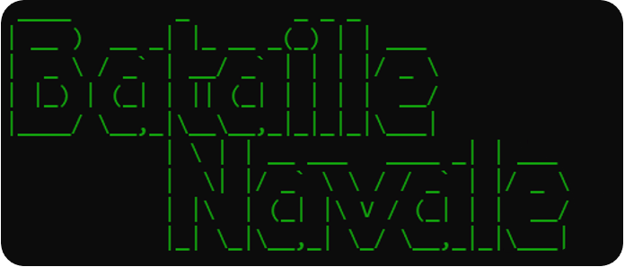
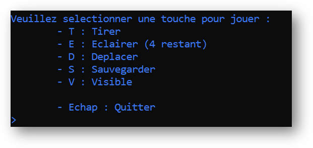

# Battleship
A simplified console version of the board game Battleship

***Project date : 2022***

##  Description
Battleship (also known as Battleships or Sea Battle) is a strategy type guessing game for two players. It is played on ruled grids (paper or board) on which each player's fleet of warships are marked. The locations of the fleets are concealed from the other player. Players alternate turns calling "shots" at the other player's ships, and the objective of the game is to destroy the opposing player's fleet. (Wikipédia)

	

⚠️This project is the result of a common work, made for school with a deadline and we chose to leave it as it was at the time of submission

# Features
## Main Menu

<b>Main menu</b>

	

   * **Tirer** - Shoot
   * **Eclairer** - Light up
   * **Deplacer** - Move
   * **Sauvegarder** - Save
   * **Visible** - Visible
   * **Echap** - Quit

 

## Game
* 2 players
* `Shoot` : Fire on an opponent's cell
* `Light Up` : Light up a 4x4 area (can be used 4 times)
* `Move` : Moving a ship
* `Save` : Save the game 
* `Visible` : Displaying opponent ships

##  User guide
* Interactions with the keyboard

#  Credits
* [**Lorenzo**](https://github.com/MrZouu) : Co-creator of the project.
* [**Mathéo**](https://github.com/sc0pziion) : Co-creator of the project.
* [**Clement Auray**](https://github.com/Clementauray) : Co-creator of the project.
* **Rémi Gaude** : Co-creator of the project.
